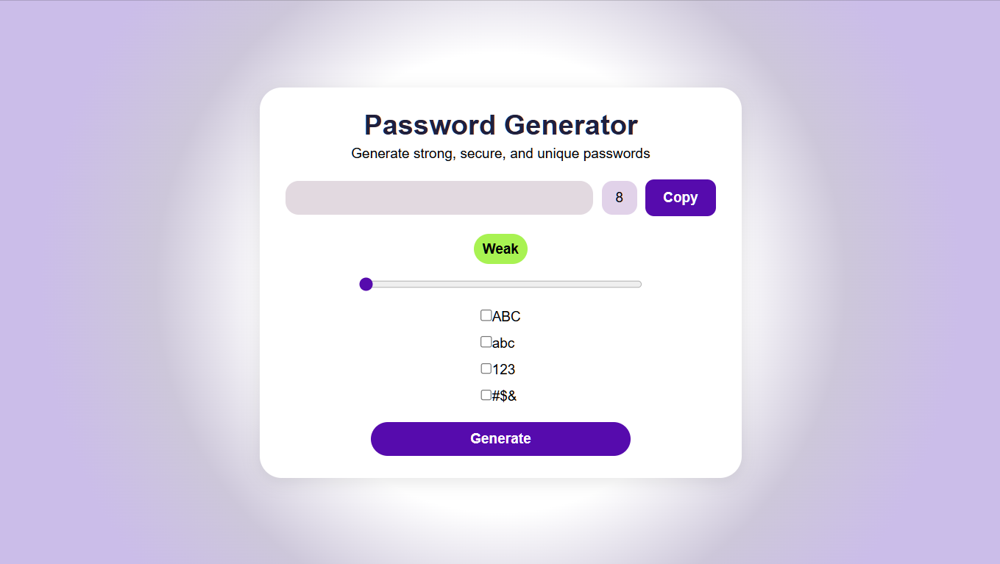

# Password Generator

This project was developed as part of the Front-End Development Internship conducted by QSkill and SR India Pvt. Ltd.

The main purpose  of this project was to build a responsive Password Generator application using React and demonstratesthe use of useState, useCallback, useEffect.
It generated random strings which depends on the criteria's choosen by the user .

## Features

- Generate secure random passwords
- Adjustable password length
- Uppercase letter selection
- Lowercase letter selection
- Number selection
- Symbol selection
- Password strength indicator
- Copy password to clipboard
- Responsive and modern user interface

## Technologies Used

- React
- JavaScript (ES6+)
- CSS3
- Vite

## Screenshot

## Learning Outcomes

Through this project, the following concepts were practiced:

- React Hooks (useState, useEffect, useCallback)
- Event Handling
- State Management
- Component Styling
- Responsive UI Design

### Author

Elsi C Pate

